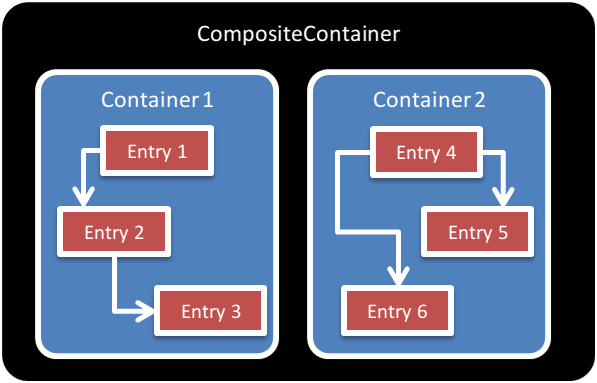
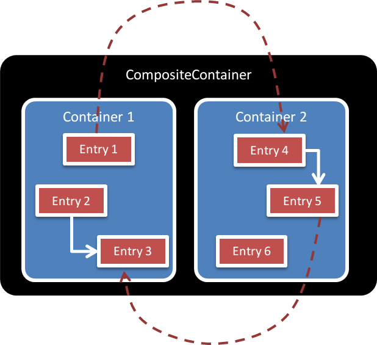

Delegate lookup feature Meta Document
=====================================

1. Summary
----------

This document describes the *delegate lookup feature*.
Containers are not required to implement this feature to respect the `ContainerInterface`.
However, containers implementing this feature will offer a greater lever of interoperability
with other containers, allowing multiple containers to share entries in the same application.
Implementation of this feature is therefore recommanded.

2. Why Bother?
--------------

The [`ContainerInterface`](../src/Interop/Container/ContainerInterface.php) ([meta doc](ContainerInterface.md))
standardizes how frameworks and libraries make use of a container to obtain objects and parameters.

By standardizing such a behavior, frameworks and libraries relying on the `ContainerInterface`
could work with any compatible container.
That would allow end users to choose their own container based on their own preferences.

The `ContainerInterface` is also enough if we want to have several containers side-by-side in the same
application. For instance, this is what the [CompositeContainer](https://github.com/jeremeamia/acclimate-container/blob/master/src/CompositeContainer.php) 
class of [Acclimate](https://github.com/jeremeamia/acclimate-container) is designed for:



However, an instance in container 1 cannot reference an instance in container 2.

It would be better if an instance of container 1 could reference an instance in container 2,
and the opposite should be true. 



In the sample above, entry 1 in container 1 is referencing entry 4 in container 2.

3. Scope
--------

### 3.1 Goals

The goal of the *delegate lookup* feature is to allow several containers to share entries.

4. Approaches
-------------

### 4.1 Chosen Approach

Containers implementing this feature can perform dependency lookups in other containers.

A container implementing this feature:

- must implement the `ContainerInterface`
- must provide a way to register a *delegate container* (using a constructor parameter, or a setter, or any
possible way). The *delegate container* must implement the `ContainerInterface`.

When a *delegate container* is configured on a container:

- Calls to the `get` method should only return an entry if the entry is part of the container.
If the entry is not part of the container, an exception should be thrown (as required in the `ContainerInterface`).
- Calls to the `has` method should only return *true* if the entry is part of the container.
If the entry is not part of the container, *false* should be returned.
 - Finally, the important part: if the entry we are fetching has dependencies,
**instead** of perfoming the dependency lookup in the container, the lookup is performed on the *delegate container*.

Important! By default, the lookup should be performed on the delegate container **only**, not on the container itself.

It is however allowed for containers to provide exception cases for special entries, and a way to lookup into 
the same container (or another container) instead of the delegate container.

### 4.2 Typical usage

The *delegate container* will usually be a composite container. A composite container is a container that
contains several other containers. When performing a lookup on a composite container, the inner containers are 
queried until one container returns an entry.
An inner container implementing the *delegate lookup feature* will return entries it contains, but if these
entries have dependencies, the dependencies lookup calls will be performed on the composite container, giving
a chance to all containers to answer.

Interestingly enough, the order in which containers are added in the composite container matters. Indeed,
the first containers to be added in the composite container can "override" the entries of containers with
lower priority.


In the example above, "container 2" contains a controller "myController" and the controller is referencing an 
"entityManager" entry. "Container 1" contains also an entry named "entityManager".
Without the *delegate lookup* feature, when requesting the "myController" instance to container 2, it would take 
in charge the instanciation of both entries.

However, using the *delegate lookup* feature, here is what happens when we ask the composite controller for the 
"myController" instance:

- The composite controller asks container 1 if if contains the "myController" instance. The answer is no.
- The composite controller asks container 2 if if contains the "myController" instance. The answer is yes.
- The composite controller performs a `get` call on container 2 for the "myController" instance.
- Container 2 sees that "myController" has a dependency on "entityManager".
- Container 2 delegates the lookup of "entityManager" to the composite controller.
- The composite controller asks container 1 if if contains the "entityManager" instance. The answer is yes.
- The composite controller performs a `get` call on container 1 for the "entityManager" instance.

In the end, we get a controller instanciated by container 2 that references an entityManager instanciated
by container 1.

### 4.3 Alternative: the fallback strategy

The first proposed approach we tried was to perform all the lookups in the "local" container,
and if a lookup fails in the container, to use the delegate container. In this scenario, the
delegate container is used in "fallback" mode.

This strategy has been described in @moufmouf blog post: http://mouf-php.com/container-interop-whats-next (solution 1).
It was also discussed [here](https://github.com/container-interop/container-interop/pull/8#issuecomment-33570697) and
[here](https://github.com/container-interop/container-interop/pull/20#issuecomment-56599631).

Problems with this strategy:

- Heavy problem regarding infinite loops
- Unable to overload a container entry with the delegate container entry

### 4.4 Alternative: force implementing an interface

The first proposed approach was to develop a `ParentAwareContainerInterface` interface.
It was proposed here: https://github.com/container-interop/container-interop/pull/8

The interface would have had the behaviour of the delegate lookup feature but would have forced the addition of
a `setParentContainter` method:

```php
interface ParentAwareContainerInterface extends ReadableContainerInterface {
    /**
     * Sets the parent container associated to that container. This container will call
     * the parent container as a fallback no entry is associated with the current identifier.
     *
     * @param ReadableContainerInterface $container
     */
    public function setParentContainer(ReadableContainerInterface $container);
}
```

The interface idea was first questioned by @Ocramius [here](https://github.com/container-interop/container-interop/pull/8#issuecomment-51721777).
@Ocramius expressed the idea that an interface should not contain setters, otherwise, it is forcing implementation
details on the class implementing the interface. 
Then @mnapoli made a proposal for a "convention" [here](https://github.com/container-interop/container-interop/pull/8#issuecomment-51841079),
this idea was further discussed until all participants in the discussion agreed to remove the interface idea
and replace it with a "standard" feature.


### 4.4 Alternative: no exception case for delegate lookups

Originally, the proposed wording for delegate lookup calls was:

> Important! The lookup MUST be performed on the delegate container **only**, not on the container itself.

This was later replaced by:

> Important! By default, the lookup SHOULD be performed on the delegate container **only**, not on the container itself.
>
> It is however allowed for containers to provide exception cases for special entries, and a way to lookup 
> into the same container (or another container) instead of the delegate container.

Exception cases have been allowed to avoid breaking dependencies with some services that must be provided
by the container (on @njasm proposal). This was proposed here: https://github.com/container-interop/container-interop/pull/20#issuecomment-56597235

